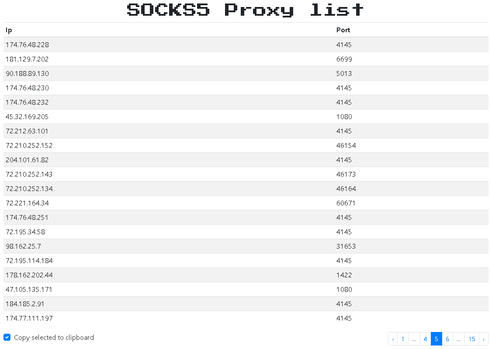

# socks5-proxy-list
SOCKS5 Proxy List

Vue.js &amp; Bootstrap, Python Flask &amp; MongoDB

Socks5 proxies are scraped from a couple different sources, checked and then saved to the database.
This cycle is repeated every two hours to refresh the list and old proxies are removed from database.

